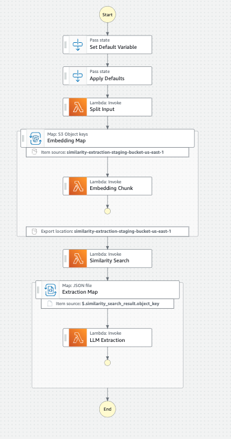

# VM-X AWS CDK Constructs

This package has the following AWS CDK constructs:

1. **SimilarityExtractionWorkflow**: Serverless AI Similarity Search Data Extraction

The goal of those constructs is to simplify and help developers use AI services in their AWS environments using the following principles:

- **Cost-effective**: The constructs are designed to be cost-effective, using serverless services whenever possible.
- **Scalable**: By preferring AWS-managed services, the solutions are scalable by default.
- **Secure**: We follow AWS best practices to ensure the least privilege principle is applied.
- **Easy to use**: The constructs are designed to be easy to use and integrate with existing AWS environments.
- **Open-source**: The constructs are open-source and can be customized to fit your needs.

## Getting Started

Install the package:

```bash
npm install @vm-x-ai/aws-cdk-constructs
```

### Constructs

In the following sections, you will find the details of each construct.

#### SimilarityExtractionWorkflow

Overall, the `SimilarityExtractionWorkflow` construct provisions a serverless approach to extract data from an origin, split the data into chunks, embeddings the data using an AI model, search for similar data, and extract the results in a pre-defined format.

Each step of the workflow could be implemented using different programming languages, by default, the construct uses Python with Poetry to deploy to the AWS Lambda functions.

##### Usage

By default, the `SimilarityExtractionWorkflow` construct expects the lambda functions to be implemented in Python with Poetry, but you can customize to use other languages, and provide the lambda function constructs to the `SimilarityExtractionWorkflow` construct.

The following example shows how to use the `SimilarityExtractionWorkflow` construct:

```typescript
import * as cdk from 'aws-cdk-lib';
import type { Construct } from 'constructs';
import { SimilarityExtractionWorkflow } from '@vm-x-ai/aws-cdk-constructs';
import { PolicyStatement } from 'aws-cdk-lib/aws-iam';

export class SimilarityExtractionStack extends cdk.Stack {
  constructor(scope: Construct, id: string, props: cdk.StackProps) {
    super(scope, id, props);

    const { similaritySearchFn, extractionFn, embeddingFn } = new SimilarityExtractionWorkflow(
      this,
      'similarity-extraction',
      {
        stateMachine: {
          extractionInputPayload: {
            'model.$': '$.model',
            'schema.$': '$.schema',
            'instructions.$': '$.instructions',
          },
        },
      },
    );

    [similaritySearchFn, extractionFn, embeddingFn].forEach((fn) => {
      fn.addEnvironment('OPENAI_API_KEY_SSM', '/dev/openai/api-key');
      fn.addToRolePolicy(
        new PolicyStatement({
          actions: ['ssm:GetParameter'],
          resources: [`arn:aws:ssm:${this.region}:${this.account}:parameter/dev/openai/api-key`],
        }),
      );
    });
  }
}
```

The python project structure should be as follows:

```text
.
├── poetry.lock
├── pyproject.toml
└── lambda_functions
    ├── embedding
    │   ├── __init__.py
    │   └── main.py
    ├── extraction
    │   ├── __init__.py
    │   └── main.py
    ├── search
    │   ├── __init__.py
    │   └── main.py
    └── split
        ├── __init__.py
        └── main.py
```

The `main.py` file should contain the lambda function handler code.

```python
...
def handler(event, context):
    ...

```

Here is a complete example of a project using the `SimilarityExtractionWorkflow` construct:

[SimilarityExtractionWorkflow Example](../../serverless/similarity-extraction/README.md)

##### Properties

- **existingStagingBucket** (`cdk.aws_s3.Bucket`): (Optional) An existing S3 bucket to store all workflow files during the execution of the workflow, if not provided a new bucket will be created.
- **stagingBucketProps** (`cdk.aws_s3.BucketProps`): (Optional) The properties to create a new S3 bucket to store all workflow files during the execution of the workflow, if not provided the bucket will be created with default properties.
  - By default, the bucket is encrypted with the default AWS Managed Key, a lifecycle rule is created to delete the objects after 7 days, and removal policy is set to `DESTROY`.
- **projectRoot** (`string`): (Optional) The path to the project root directory, where the `pyproject.toml` and `poetry.lock` files are located, if not provided it used the current working directory.
- **lambdas** (`object`): (Optional)
  - **layerProps** (`Partial<cdk.aws_lambda.LayerVersionProps>`): (Optional) The properties to create a new lambda layer with the required dependencies to run the lambda functions in the workflow, if not provided the layer will be created with default properties.
    - By default, the layer is created with the latest Python 3.10 runtime, and the dependencies are installed using Poetry.
  - **splitFn** (`object`): (Optional)
    - **fn** (`cdk.aws_lambda.Function`): (Optional) An existing lambda function to split the input data into chunks, if not provided a new lambda function will be created with default properties. (In the next section there are more details about the lambda function)
    - **props**: (`Partial<FunctionProps>`): (Optional) The properties to create a new lambda function to split the input data into chunks, if not provided the lambda function will be created with default properties.
      - **15** minutes timeout
      - **1024MB** memory
      - **512MB** disk space
      - Python **3.10** runtime
      - handler: `lambda_functions/split/main.handler`
  - **embeddingFn** (`object`): (Optional)
    - **fn** (`cdk.aws_lambda.Function`): (Optional) An existing lambda function to be invoked by the distributed map to embed the chunk data, if not provided a new lambda function will be created with default properties. (In the next section there are more details about the lambda function)
    - **props**: (`Partial<FunctionProps>`): (Optional) The properties to create a new lambda function to be invoked by the distributed map to embed the chunk data, if not provided the lambda function will be created with default properties.
      - **15** minutes timeout
      - **1024MB** memory
      - **512MB** disk space
      - Python **3.10** runtime
      - handler: `lambda_functions/embedding/main.handler`
  - **similaritySearchFn** (`object`): (Optional)
    - **fn** (`cdk.aws_lambda.Function`): (Optional) An existing lambda function to perform the similarity search in the vectordb, if not provided a new lambda function will be created with default properties. (In the next section there are more details about the lambda function)
    - **props**: (`Partial<FunctionProps>`): (Optional) The properties to create a new lambda function to perform the similarity search in the vectordb, if not provided the lambda function will be created with default properties.
      - **15** minutes timeout
      - **1024MB** memory
      - **512MB** disk space
      - Python **3.10** runtime
      - handler: `lambda_functions/embedding/main.handler`
  - **extractionFn** (`object`): (Optional)
    - **fn** (`cdk.aws_lambda.Function`): (Optional) An existing lambda function to extract data using the LLM provider, if not provided a new lambda function will be created with default properties. (In the next section there are more details about the lambda function)
    - **props**: (`Partial<FunctionProps>`): (Optional) The properties to create a new lambda function to extract data using the LLM provider, if not provided the lambda function will be created with default properties.
      - **15** minutes timeout
      - **1024MB** memory
      - **512MB** disk space
      - Python **3.10** runtime
      - handler: `lambda_functions/embedding/main.handler`
- **stateMachine** (`object`): (Optional)
  - **splitInputPayload** (`object`): (Optional) The payload mapping to pass the input data to the `Split Input` lambda function, the following object is always provided to the lambda `{ "execution_id.$": "$$.Execution.Name" }`
  - **extractionInputPayload** (`object`): (Optional) The payload mapping to pass the input data to the `LLM Extraction` lambda function, the following object is always provided to the lambda. `{ "item.$": "$$.Map.Item.Value", "execution_id.$": "$$.Execution.Name" }`

##### Architecture



The architecture is based on the AWS Step Functions service, which orchestrates the workflow and the AWS Lambda functions that execute the steps of the workflow.

The workflow is defined as follows:

**1. Set Default Variables**: This step defines the default variables for the workflow, such as the `max_concurrency` for the parallel execution of the workflow or `similarity_search_max_results` that defines the number of similar results to be returned.

```json
{
  "max_concurrency": 10,
  "tolerated_failure_percentage": 0,
  "similarity_search_max_results": 5
}
```

| Variable                        | Description                                                                                                                                | Default |
| ------------------------------- | ------------------------------------------------------------------------------------------------------------------------------------------ | ------- |
| `max_concurrency`               | There are a few steps in the workflow that execute lambdas in parallel, this variable defines the max number of lambdas to run in parallel | 10      |
| `tolerated_failure_percentage`  | The percentage of tolerated failures in the workflow for the parallel steps                                                                | 0       |
| `similarity_search_max_results` | The number of similar results to be returned by the similarity search engine                                                               | 5       |

**2. Apply Defaults**: This step merges the default variables with the input variables, overwriting the default values if the input values are defined.

**3. Split Input**: This step invokes a lambda function that is responsible for splitting the input data into chunks, the number of chunks, or how the data is split is implemented by the user.

This example is based on the LangChain [How to handle long text when doing extraction](https://python.langchain.com/v0.2/docs/how_to/extraction_long_text/) documentation.

In this step the lambda function handler code is defined as follows:

```python
import logging
import re
from typing import Any

import requests
from langchain_community.document_loaders import BSHTMLLoader
from langchain_text_splitters import TokenTextSplitter
from vmxai_extraction.sfn.split import SplitLambdaHandlerEvent, split_handler

logger = logging.getLogger()


@split_handler()
def handler(event: SplitLambdaHandlerEvent, context: Any) -> list[str]:
    logger.info("Received event", extra={"event": event})

    response = requests.get("https://en.wikipedia.org/wiki/Car")
    with open("/tmp/car.html", "w", encoding="utf-8") as f:
        f.write(response.text)

    loader = BSHTMLLoader("/tmp/car.html")
    document = loader.load()[0]
    document.page_content = re.sub("\n\n+", "\n", document.page_content)

    text_splitter = TokenTextSplitter(
        chunk_size=2000,
        chunk_overlap=20,
    )

    texts = text_splitter.split_text(document.page_content)
    logger.info(f"Number of text chunks: {len(texts)}")

    return texts

```

To make the development of the lambda function easier, all the complexity required by the AWS Step Functions is abstracted by the `split_handler` decorator.

Since AWS Step Functions has a limitation of 256KB for the state input/output, so the chunks produced by this lambda, the `split_handler` decorator is responsible for receiving the chunks and storing them in an S3 bucket.

The `split_handler` splits the list of chunks into smaller lists and stores them into individual files in the S3 bucket, in this way, we avoid the memory limitation of the next lambda function that will process the chunks.

You can provide the `chunk_size` as a parameter or set the `CHUNK_SIZE` environment variable, the default value is `10`.

Example:

```python
@split_handler(chunk_size=5)
```

Input

```text
[1, 2, 3, 4, 5, 6, 7, 8, 9, 10]
```

Output:

```text
[[1, 2, 3, 4, 5], [6, 7, 8, 9, 10]]
```

The `split_handler` decorator uses the following pattern to store the chunks in the S3 bucket:

```text
date={YYYY-MM-DD}/execution_id={execution_id}/split/chunk={index}/items.json
```

**NOTE**: The `execution_id` is a unique identifier for the execution of the workflow.

And returns the following output to the AWS Step Functions:

```json
{
  "bucket": "bucket_name",
  "key_prefix": "date={YYYY-MM-DD}/execution_id={execution_id}/split/"
}
```

**4. Embedding Map**

This step uses the [AWS Step Functions Distributed Map](https://aws.amazon.com/blogs/aws/step-functions-distributed-map-a-serverless-solution-for-large-scale-parallel-data-processing/) operator, this operator uses the AWS S3 APIs to list the objects in the S3 bucket by the prefix returned by the **Split Input** lambda function, and for each S3 object, it invokes a lambda function that is responsible for embedding the data.

By using the Distributed Map operator we overcome the limitation of the AWS Step Functions payload size and the number of items that can be processed in parallel, and also the size of the data exchanged between the steps, allowing the workflow to process a large number of items in the workflow.

**4.1. Embedding Chunk**

This lambda is invoked by the Distributed Map operator and receives the chunk S3 object key as input, in the following format:

```json
{
  "Etag": "\"XXXXX\"",
  "Key": "date=XXXX-XX-XX/execution_id=XXXXXXX/split/chunk=X/items.json",
  "LastModified": 1111111,
  "Size": 111,
  "StorageClass": "STANDARD"
}
```

The lambda function handler code is defined as follows:

```python
import logging
from typing import Any

from langchain_openai import OpenAIEmbeddings
from vmxai_extraction.sfn.store_embedding import EmbeddingLambdaHandlerEvent, store_embedding_handler

from lambda_functions.util import get_openai_api_key

logger = logging.getLogger()


@store_embedding_handler()
def handler(chunks: list[str], event: EmbeddingLambdaHandlerEvent, context: Any) -> list[list[float]]:
    logger.info("Embedding documents", extra={"count": len(chunks)})
    embedder = OpenAIEmbeddings(api_key=get_openai_api_key())

    return embedder.embed_documents(chunks)

```

**NOTE**: In this example, we are using the `OpenAIEmbeddings` class from the `langchain_openai` package, you can replace it with any other AI model that you want to use.

**NOTE**: The `get_openai_api_key` function is a helper function that retrieves the OpenAI API key from the AWS SSM Parameter Store.

Following the same pattern used in the **Split Input** lambda, in this lambda the `store_embedding_handler` decorator is used to abstract the complexity added by the AWS Step Functions.

In this case, the `store_embedding_handler` decorator identifies the input from the Distributed Map operator gets the S3 object content, and provides it to the lambda function handler as a list of strings.

The `embedder.embed_documents(chunks)` from LangChain returns a list of embedding, for each chunk string it returns a list of floats.

```json
[
 [0.1, 0.2, 0.3, 0.4, 0.5, ...],
 [0.6, 0.7, 0.8, 0.9, 1.0, ...]
]
```

The `store_embedding_handler` decorator receives the embeddings and stores them in the S3 bucket using the following pattern:

```text
date={YYYY-MM-DD}/execution_id={execution_id}/embedding/chunk={index}/embedding.json
```

**NOTE**: In this example, the embeddings need to be stored because the next steps of the workflow will use them to search for similarity, but if you are using a dedicated vector store (e.g. pgvector, elasticsearch, etc) you can store them directly to the vector store and the decorator will ignore and not store them in the S3 bucket, this approach is recommended for production and large-scale workflows.

And returns the following output to the AWS Step Functions:

```json
{
  "bucket": "bucket_name",
  "object_key": "date={YYYY-MM-DD}/execution_id={execution_id}/embedding/chunk={index}/embedding.json"
}
```

**5. Similarity Search**

The Distributed Map operator waits for all the items to be processed and writes a manifest file in the S3 bucket with the following format:

```json
{
  "DestinationBucket": "xxxxxxx",
  "MapRunArn": "arn:aws:states:us-east-1:123456789012:mapRun:similarity-extraction-workflow/xxxxx:xxxxx",
  "ResultFiles": {
    "FAILED": [],
    "PENDING": [],
    "SUCCEEDED": [
      {
        "Key": "date=XXXX-XX-XX/execution_id=xxxxxxx/embedding/output/xxxxx/SUCCEEDED_0.json",
        "Size": 2161
      }
    ]
  }
}
```

**NOTE**: The number of files in the `SUCCEEDED` list is managed by the Distributed Map operator.

The **Similarity Search** lambda function is invoked after the Distributed Map operator finishes processing all the items, and the workflow uses the following input format to the lambda function:

```json
{
  "bucket": "xxxxxxx",
  "manifest_key": "xxxxxxx",
  "query": "xxxxxxx",
  "max_results": 5,
  "execution_id": "xxxxxxx"
}
```

The lambda function handler code is defined as follows:

```python
import logging
from typing import Any

from langchain_community.vectorstores import FAISS
from langchain_core.documents import Document
from langchain_openai import OpenAIEmbeddings
from vmxai_extraction.sfn.local_similarity_search import (
    LocalSimilaritySearchLambdaHandlerEvent,
    local_similarity_search_handler,
)

from lambda_functions.util import get_openai_api_key

logger = logging.getLogger()


@local_similarity_search_handler()
def handler(
    embeddings: list[tuple[str, list[float]]], event: LocalSimilaritySearchLambdaHandlerEvent, context: Any
) -> list[Document]:
    logger.info("Creating vector store", extra={"documents": len(embeddings)})
    embedder = OpenAIEmbeddings(api_key=get_openai_api_key())
    vectorstore = FAISS.from_embeddings(
        text_embeddings=[(text, embedding) for text, embedding in embeddings],
        embedding=embedder,
    )

    retriever = vectorstore.as_retriever(search_kwargs={"k": event["max_results"]})
    return retriever.invoke(event["query"])

```

**NOTE**: In this example, we are using the `FAISS` class from the `langchain_community` package, you can replace it with any other similarity search engine that you want to use.

In this step, the `local_similarity_search_handler` decorator reads the manifest file recursively reads the embeddings from the S3 bucket, and combines them into a list of tuples that contains the text and the embedding list.

The `embeddings` parameter is passed to the lambda function handler and can be used to create the in-memory vector store and search for similar documents.

The `query` and `max_results` must be provided to the workflow when invoking the workflow, the `query` is the text that you want to search for similar documents, and the `max_results` is the number of similar documents to be returned.

The `retriever.invoke(event["query"])` from LangChain returns a list of `Document` objects, each `Document` object contains the text of the chunk.

```json
[
 {
    "page_content": "xxxxxxx",
    ...
 }
]
```

The `local_similarity_search_handler` decorator receives the documents and stores them in the S3 bucket using the following pattern:

```text
date={YYYY-MM-DD}/execution_id={execution_id}/search/results.json
```

The JSON file contains the list of documents that are similar to the query.

And returns the following output to the AWS Step Functions:

```json
{
  "bucket": "bucket_name",
  "object_key": "date={YYYY-MM-DD}/execution_id={execution_id}/search/results.json"
}
```

**6. Extraction Map**

This step also uses the AWS Step Functions Distributed Map operator, but in this case, it uses the `getObject` S3 API and uses a JSON interpreter to read the results from the **Similarity Search** lambda function.

Each item in the JSON file becomes an item in the Distributed Map operator, and for each item, it invokes a lambda function that is responsible for extracting the data.

**6.1. LLM Extraction**

This lambda is invoked by the Distributed Map operator and receives the document as input, in the following format:

```json
{
  "item": {
    "page_content": "xxxxxxx",
    ...
 },
  "execution_id": "xxxxxx",
  "model": "xxxxxx",
  "schema": {...},
  "instructions": "xxxxxx"
}
```

In this example, the `model`, `schema`, and `instructions` are provided to the workflow when invoking the workflow, but you can set them in the code directly.

The lambda function handler code is defined as follows:

```python
import logging
from typing import Any, TypedDict

from langchain_core.documents import Document
from langchain_core.prompts import ChatPromptTemplate
from langchain_openai import ChatOpenAI

from lambda_functions.util import get_openai_api_key

logger = logging.getLogger()


class Event(TypedDict):
    item: dict
    execution_id: str
    model: str
    schema: dict
    instructions: str


def handler(event: Event, context: Any):
    logger.info("Received event", extra={"event": event})

    prompt = ChatPromptTemplate.from_messages(
        [
            (
                "system",
                event["instructions"],
            ),
            ("human", "{text}"),
        ]
    )

    logger.info("Initializing the LLM provider")
    llm = ChatOpenAI(
        model=event["model"],
        temperature=0,
        api_key=get_openai_api_key(),
    )

    logger.info("Initializing the extraction pipeline")
    extractor = prompt | llm.with_structured_output(
        schema={
            "name": "extraction",
            "description": "Data extraction from context",
            "parameters": event["schema"],
        },
        method="function_calling",
        include_raw=False,
    )

    document = Document.parse_obj(event["item"])

    logger.info("Extracting developments from the text")
    extractions = extractor.invoke({"text": document.page_content})

    logger.info("Extracted", extra={"extractions": extractions})

```

This is the only lambda function that does have any decorator because the lambda is already receiving the document to be extracted and it has all the information required to extract the data.

In this example, we are using the LangChain structured output pattern to extract a specific schema from the text, but you can replace it with any other extraction model that you want to use.

The `extractor.invoke({"text": document.page_content})` from LangChain returns a list of extractions, each extraction is a dictionary with the extracted data.

```json
[
 {
    "name": "xxxxxxx",
    "value": "xxxxxxx",
    ...
 }
]
```

**6.2. Store Results**

In this point, the extracted data can be used in different ways, like storing in a database, sending to a queue, calling an API, storing to a data lake, etc.
