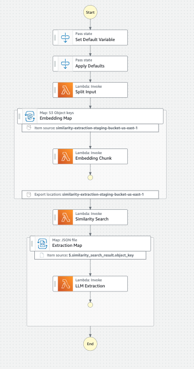

# AWS Serverless Similarity Extraction

This project is an implementation of the [How to handle long text when doing extraction](https://python.langchain.com/v0.2/docs/how_to/extraction_long_text/) Langchain guide using AWS Serverless components, and uses the [VM-X AI CDK Constructs](../../cdk/constructs/README.md) to deploy the necessary infrastructure.

## Architecture

For more information about this architecture, please refer to the [VM-X AI CDK Constructs - SimilarityExtractionWorkflow](../../cdk/constructs/README.md#similarityextractionworkflow) construct documentation.
